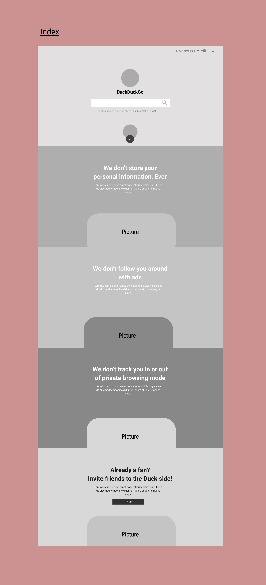

# Development Strategy

> `duck-duck-clone`

write a short description of your project:
- who would want to use it?
- why would they want to use it?

Our task is to clone the [home page of Duck Duck Go](https://duckduckgo.com/?va=z&t=hr&atb=v214-1). Every member of the team will do a part of the assignment.
We will work on the same HTML and CSS files, and each student will make a section.
We decided to use Bootstrap. We try to avoid conflicts by using prefixes in our divs like in `monster-main` and by using ids instead of classes. While the common divs will use the conventional classes used in Bootstrap.

Example:

```html
<!-- section monster -->
<div class="container>
  <div class="row">
    <div id="monster-main>
    </div>
  </div>              
</div>
```

<div align = "center">
  
Home section | Monster section | Ghost section | Bathtub section | Alpinist section
------------- | ------------- | ------------- | ------------- | -------------
Burak  | Divya | Kemi | Patrick | Bermarte

</div>


## Wireframe

<!-- include a wireframe for your project in this repository, and display it here -->
<!-- wireframe.cc is a good site for getting started with wireframes -->
<p align="center">

</p>

## 0. Set-Up
this user-story was developed in the `main branch`

__A User can see my initial repository and live demo__

### Repo

- [x] Generate from Template
- [x] Invite group members
- [x] Write initial, basic README
- [x] Write initial, basic development-strategy.md
- [x] Create basic Project Board
- [x] Turn on GitHub Pages

### HTML

Edit `index.html`

- [x] Add a title
- [x] Add comments to divide tasks
- [x] Add links to Bootstrap and to Javascript

### CSS

- [x] Create css/style.css
- [x] Add comments to divide tasks

---

## 1. - Make a Wireframe

__Create a Wireframe__

### Repo

assigned to **Bermarte**

- [ ] This user story was developed on a brach called `wireframe`
- [ ] It was merged into main when the feature was finished


### HTML

nothing done

### CSS

nothing done

---
# 2. - Make the home section

assigned to **Burak**

<p align="left">

</p>

- [ ] Create an individual Issue for the assignment
- [ ] This user story was developed on a brach called `home`
- [ ] It was merged into main when the feature was finished


### HTML

- [ ] This feature was developed in the 'index' section within `index.html`

### CSS

- [ ] This feature was developed in `style.css`

---
# 3. - Make the monster section

assigned to **Divya**

<p align="left">

</p>

- [ ] Create an individual Issue for the assignment
- [ ] This user story was developed on a brach called `monster`
- [ ] It was merged into main when the feature was finished


### HTML

- [ ] This feature was developed in the 'monster' section within `index.html`

### CSS

- [ ] This feature was developed in `style.css`

---
# 4. - Make the ghost section

assigned to **Kemi**

<p align="left">

</p>

- [ ] Create an individual Issue for the assignment
- [ ] This user story was developed on a brach called `ghost`
- [ ] It was merged into main when the feature was finished


### HTML

- [ ] This feature was developed in the 'ghost' section within `index.html`

### CSS

- [ ] This feature was developed in `style.css`

---

# 5. - Make the bathtub section

assigned to **Patrick**

<p align="left">

</p>

- [ ] Create an individual Issue for the assignment
- [ ] This user story was developed on a brach called `bathtub`
- [ ] It was merged into main when the feature was finished


### HTML

- [ ] This feature was developed in the 'batthub' section within `index.html`

### CSS

- [ ] This feature was developed in `style.css`

---

# 6. - Make the alpinist section

assigned to **Bermarte**

<p align="left">

</p>

- [ ] Create an individual Issue for the assignment
- [ ] This user story was developed on a brach called `alpinist`
- [ ] It was merged into main when the feature was finished


### HTML

- [ ] This feature was developed in the 'alpinist' section within `index.html`

### CSS

- [ ] This feature was developed in `style.css`
